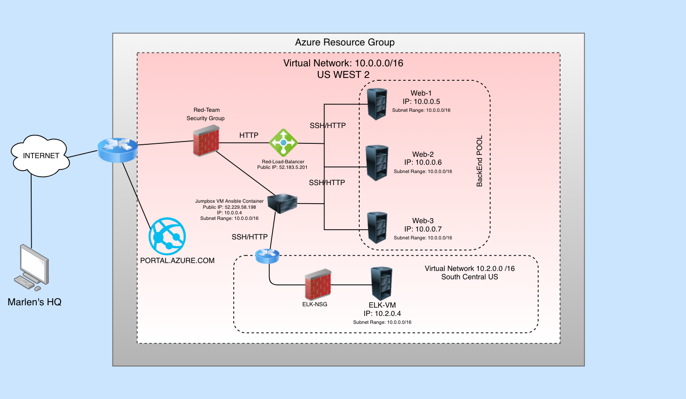

README - PROJECT 1 

## Automated ELK Stack Deployment
​
The files in this repository were used to configure the network depicted below.
​



​
These files have been tested and used to generate a live ELK deployment on Azure. They can be used to either recreate the entire deployment pictured above. Alternatively, select portions of the _____ file may be used to install only certain pieces of it, such as Filebeat.
​
  - _[Elk Playbook File](Ansible/Ansible_ELK_install.yml)_
​

This document contains the following details:
- Description of the Topologu
- Access Policies
- ELK Configuration
  - Beats in Use
  - Machines Being Monitored
- How to Use the Ansible Build
​
​
### Description of the Topology
​
The main purpose of this network is to expose a load-balanced and distribute the traffic to three monitored instance of DVWA, the D*mn Vulnerable Web Application.
​
Load balancing ensures that the application will be highly available, in addition to restricting access to the network.
- _What aspect of security do load balancers protect? What is the advantage of a jump box?_
  - Load balancers protect us DDos attacks.  
  - Attack surface is smaller and limits the exposure of the internet.
​
Integrating an ELK server allows users to easily monitor the vulnerable VMs for changes to the configuration settings and system logs.
- _What does Filebeat watch for?_
  - SSH logins, sudo commands, and syslogs
- _What does Metricbeat record?_
  - CPU usage, RAM usage, and network usage
​
The configuration details of each machine may be found below.
​

| Name     | Function | IP Address | Operating System |
|----------|----------|------------|------------------|
| Jump Box | Gateway  | 10.0.0.4   | Linux            |
| Web-1    | Webserver| 10.0.0.5   | Linux            |
| Web-2    | Webserver| 10.0.0.6   | Linux            |
| Web-3    | Webserver| 10.0.0.7   | Linux            |
​
### Access Policies
​
The machines on the internal network are not exposed to the public Internet. 
​
Only the `Jumpbox` machine can accept connections from the Internet. Access to this machine is only allowed from the following IP addresses:
  - _Marlen's computer is the only computer that has access to the Jumpbox_
​
Machines within the network can only be accessed by `Ansible container`.
- _Which machine did you allow to access your ELK VM? What was its IP address?_
  - `Ansible container` with IP address of 10.0.0.4
​
A summary of the access policies in place can be found in the table below.
​

| Name     | Publicly Accessible | Allowed IP Addresses |
|----------|---------------------|----------------------|
| Jump Box |     Yes             | 10.0.0.1 10.0.0.2    |
| Web-1    | SSH - No HTTP - Yes | 10.0.0.5             |
| Web-2    | SSH - No HTTP - Yes | 10.0.0.6             |
| Web-3    | SSH - No HTTP - Yes | 10.0.0.7             |​
| ELK      | SSH - No HTTP - Yes | 10.2.0.4             |​

### Elk Configuration
​
Ansible was used to automate configuration of the ELK machine. No configuration was performed manually, which is advantageous because...
- _What is the main advantage of automating configuration with Ansible?_
  - It is fast and efficient and reduces the likelihood for human error. It also allows us to have a patch management system that we can do version control anytime we want to update the machine.
The playbook implements the following tasks:
- _In 3-5 bullets, explain the steps of the ELK installation play. E.g., install Docker; download image; etc._
  - Install docker
  - Install python to support the container
  - Increase the memory to support the minimum RAM requirements of 4GB via Microsoft Azure
  - Install the ELK container and open up certain ports
  - Start the container to run ELK 
​
The following screenshot displays the result of running `docker ps` after successfully configuring the ELK instance.
​

(Images/docker_ps_output.png)
​
### Target Machines & Beats
This ELK server is configured to monitor the following machines:
- _List the IP addresses of the machines you are monitoring_  
   - Public IP of Web-1 : 52.183.5.201 
Private Ip of Web-1: 10.0.0.5  
    - Public IP of Web-2: 52.183.5.201
Private IP of Web-2: 10.0.0.6
    - Public Ip of Web-3:52.183.5.201 
Private IP of Web-3: 10.0.0.7

​
We have installed the following Beats on these machines:
- _Specify which Beats you successfully installed_
  - metricbeat, filebeat
​
These Beats allow us to collect the following information from each machine:
- _In 1-2 sentences, explain what kind of data each beat collects, and provide 1 example of what you expect to see. E.g., `Winlogbeat` collects Windows logs, which we use to track user logon events, etc._
  - filebeat: collects ssh logins, sudo commands, and syslogs
  - metricbeat: collects CPU usage, RAM usage, and network usage
​
### Using the Playbook
In order to use the playbook, you will need to have an Ansible control node already configured. Assuming you have such a control node provisioned: 
​
SSH into the control node and follow the steps below:
- Copy the `/etc/ansible/files/filebeat-config.yml` file to `/etc/filebeat/filebeat.yml`
- Update the filebeat.yml file to include the the kibana url: localhost:5601 password: "changeme"
  ```
  output.elasticsearch:
  hosts: localhost:9600
  username: "elastic"
  password: "<password>"
  setup.kibana:
  host: localhost:5601
  ```

- Run the playbook, and navigate to `etc/filebeat/filebeat.yml` to check that the installation worked as expected.
​
_Answer the following questions to fill in the blanks:_
- _Which file is the playbook? Where do you copy it?_
  - `filebeat-playbook.yml` and I would copy it to the `/etc/filebeat/filebeat.yml`
- _Which file do you update to make Ansible run the playbook on a specific machine? How do I specify which machine to install the ELK server on versus which to install Filebeat on?_
  - `/etc/ansible/hosts` and I would label the group as [elk] and put the ip addresses under that server group
- _Which URL do you navigate to in order to check that the ELK server is running?
  - http://157.55.197.62:5601
​
